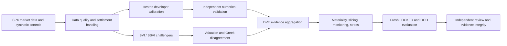
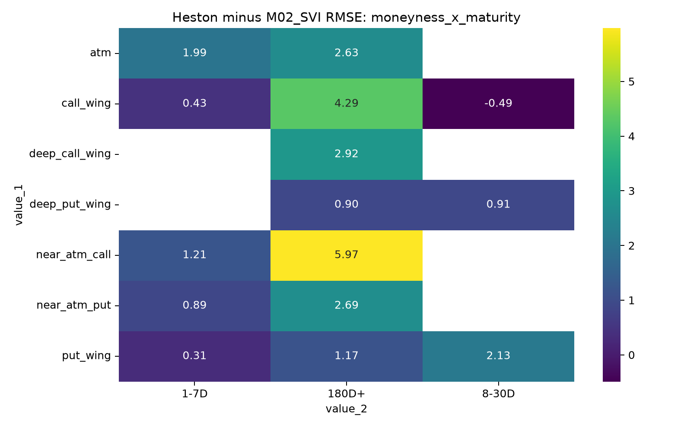
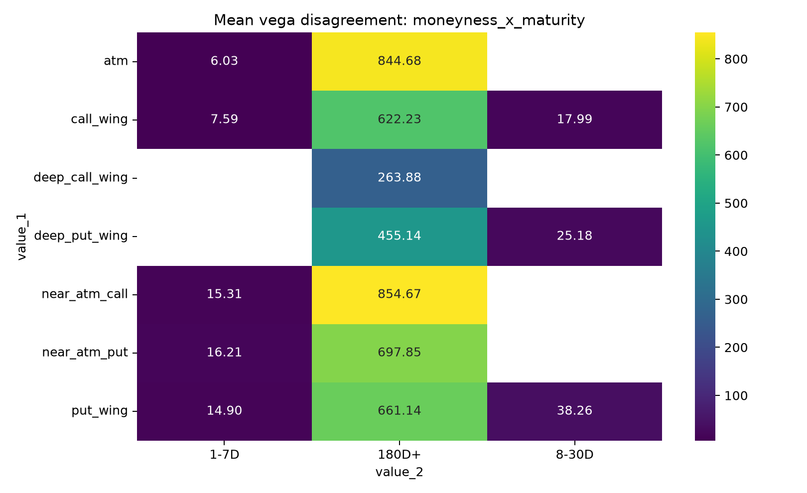
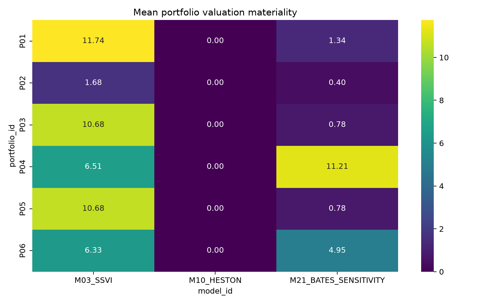

# DerivGuard-MRM

[](https://github.com/ReviveCoding/DerivGuard-MRM/actions/workflows/ci.yml)
[](https://github.com/ReviveCoding/DerivGuard-MRM/releases/latest)

**Evidence-controlled model-risk research for SPX option pricing and validation.**

DerivGuard-MRM develops and independently challenges a Heston option-pricing model against SVI/SSVI alternatives, with explicit controls for calibration uncertainty, numerical validation, economic materiality, stress testing, model disagreement, and distribution shift.

The accepted v1.1 scientific release passed an independent scientific/code re-review. It is research software only. It is not approved for live trading, production valuation, capital, or brokerage execution.

## Highlights

| Area | v1.1 evidence |
| --- | --- |
| Post-validation analytics | 9,720 contract-model observations across 126 market dates |
| Controlled stress repricing | 155,520 contract-scenario rows and 240 aggregate scenario rows |
| Ordinary locked DVE | FPR 0.069 vs 0.103 for FitOnly, with recall 1.000 for both |
| OOD challenge | Full DVE FPR 0.615 vs 0.154 for FitOnly |
| Winner uncertainty | 16 of 39 signed winner-vs-runner-up bootstrap intervals cross zero |
| Local qualification | 279 Pytest tests passed, including 16 numerical and 5 CUDA/GPU tests |
| Independent review | **ACCEPTED** |
| Published evidence | 64 machine-readable result files and 49 publication figures in the accepted internal release |

The central model-risk conclusion is intentionally qualified: multi-evidence DVE reduced false positives on the ordinary locked sample, but that improvement did **not** transfer robustly under OOD shift. The release therefore makes no claim of global DVE superiority or production readiness.

## Research architecture



## Representative diagnostics

<p align="center">
  
  
  
</p>

These figures show the project at the level where model-risk conclusions are actually made: not only aggregate fit, but where pricing error, Greek disagreement, and portfolio materiality concentrate across the option surface.

## What v1.1 adds

- Heston calibration diagnostics, bootstrap uncertainty, parameter correlation, profile-width analysis, and multistart stability.
- Economically defined moneyness, maturity, volatility, liquidity, settlement, and data-quality slices.
- Signed residual analysis and two-dimensional error surfaces.
- Qualified model-winner maps with date-block bootstrap uncertainty.
- Challenger attribution and explicit low-valuation-disagreement / high-Greek-disagreement cases.
- Portfolio-level valuation and Greek materiality analysis.
- Production-style rolling median/MAD, EWMA, and CUSUM monitoring diagnostics.
- Controlled spot, volatility, rate, Heston rho, vol-of-vol, and spread stress repricing.
- Fresh DVE confirmatory evaluation on ordinary locked and OOD samples.
- Independent scientific/code re-review and evidence-integrity verification.

## Evidence and reports

- [Technical report](reports/TECHNICAL_REPORT.md)
- [Final v1.1 acceptance report](reports/v1_1/FINAL_V1_1_ACCEPTANCE_REPORT.md)
- [Independent scientific/code re-review](reports/v1_1/INDEPENDENT_REVIEW.md)
- [Post-validation analytics](reports/v1_1/POST_VALIDATION_ANALYTICS.md)
- [Fresh DVE confirmatory study](reports/v1_1/DVE_V1_1_CONFIRMATORY.md)
- [Model winner map](reports/v1_1/MODEL_WINNER_MAP.md)
- [Greek-risk analysis](reports/v1_1/GREEK_RISK_ANALYSIS.md)
- [Calibration diagnostics](reports/v1_1/CALIBRATION_DIAGNOSTICS.md)
- [Publication provenance and data exclusions](docs/PUBLICATION_PROVENANCE.md)
- [v1.1 release notes](docs/releases/DERIVGUARD_V1_1.md)

## CPU-safe reproduction

Python 3.12 is the qualified hosted-CI baseline.

```bash
python -m venv .venv
python -m pip install --upgrade pip
python -m pip install "torch==2.14.0+cpu" --index-url https://download.pytorch.org/whl/cpu
python -m pip install -e ".[dev,oracle]"

python -m pip check
python -m ruff format --check src tests scripts
python -m ruff check src tests scripts
python -m mypy src
python -m pytest -q -m "not gpu and not numerical"
python -m pytest -q -m numerical
python scripts/verify_publication_integrity.py
```

GitHub-hosted CI is intentionally CPU-only. It runs source-quality checks, 257 CPU-safe tests, all 16 numerical tests, and read-only verification of the published DVE evidence. The five accepted CUDA/GPU tests, one CUDA-dependent confirmatory integration path, and the full calibration/stress research program remain qualified local-only workflows.

## Repository map

| Path | Purpose |
| --- | --- |
| `src/derivguard/` | Pricing, calibration, challengers, validation, materiality, monitoring, and research workflows |
| `tests/` | Unit, integration, numerical, regression, and GPU qualification tests |
| `configs/` | Model, calibration, data-quality, and experiment configuration |
| `experiments/` | Experiment registries and confirmatory specifications |
| `governance/` | Hypothesis registries, controls, and frozen validation definitions |
| `reports/` | v1 technical, validation, limitation, and reproducibility reports |
| `reports/v1_1/` | Post-validation analytics and accepted v1.1 review package |
| `results/` | Publication-safe aggregate and synthetic evidence |
| `artifacts/` | Publication-safe freeze, release, and integrity manifests |
| `docs/` | Numerical methods, publication provenance, and release notes |

## Scope, provenance, and limitations

The public Git history is a sanitized publication history assembled from the authoritative research snapshots. Vendor-derived quote data, intermediate market data, empirical checkpoints, raw/contract-level real-data tables, and contract-scenario stress rows are intentionally not distributed.

The following scientific limitations remain part of the accepted result:

- OOD robustness of Full DVE failed materially.
- Calibration bootstrap and profile-width methods are local diagnostic approximations.
- SVI/SSVI stress outputs use the disclosed sticky-strike convention.
- The Heston CPU comparison is a bounded 12-row deterministic spot-scenario check, not a comprehensive CPU comparison across every stress family.
- 0DTE pricing remains unavailable.
- Synchronized temporal OOS evaluation remains unavailable.
- Hedge/P&L conclusions remain unavailable.

See [Publication Provenance](docs/PUBLICATION_PROVENANCE.md) for the exact public/internal boundary.

## Versioning

`derivguard-v1.0` and `derivguard-v1.1` are immutable sanitized publication snapshots. The `derivguard-v1.1` tag is the accepted scientific release. The `main` branch may receive documentation, metadata, and repository-presentation improvements that do not modify accepted scientific evidence.

## License and citation

The repository is publicly viewable for research and portfolio evaluation, but it is not released under an open-source license. See [LICENSE.md](LICENSE.md) for the code-use terms and [Publication Provenance](docs/PUBLICATION_PROVENANCE.md) for data-rights boundaries.

If you reference the software, use the repository's [CITATION.cff](CITATION.cff). GitHub can render it through the repository's **Cite this repository** control.
